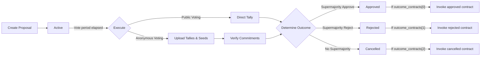
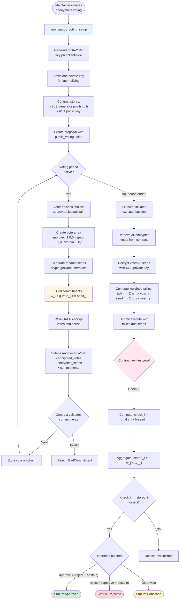
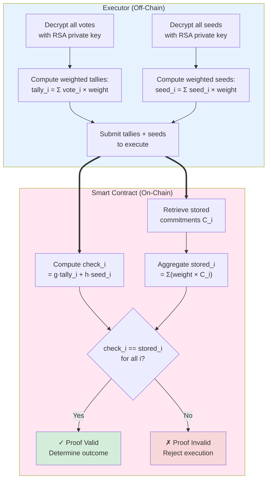

# Governance & Proposals

Each project registered on Tansu automatically gets its own **Decentralized Autonomous Organization (DAO)** smart-contract state. This DAO enables maintainers and community members to discuss, vote and execute actions in an auditable, on-chain way.

## Proposal lifecycle



1. **create_proposal** -- any address submits a new proposal (title, ipfs, voting_ends_at, public_voting, optional outcome_contracts, optional token_contract) and deposits the [proposal deposit](#spam-and-sybil-resistance). The dApp only shows the button to maintainers, but other front-ends call the contract directly -- the [Stellar Registry](#acting-on-other-contracts) and the SCF Public Goods Award workflow both do.
2. **Active** -- during the voting window members cast weighted votes (approve, reject, abstain).
3. **Tallies** -- once voting ends and the [execution delay](#project-governance-settings) has passed, a maintainer tallies (using execute) -- if anonymous, tallies & seeds are supplied.
4. The proposal status becomes **Approved**, **Rejected** or **Cancelled** based on supermajority rules.
5. If **outcome_contracts** are specified, the contract at the matching index is invoked:

- **Approved** → `outcome_contracts[0].execute_fn(args)`
- **Rejected** → `outcome_contracts[1].execute_fn(args)`
- **Cancelled** → `outcome_contracts[2].execute_fn(args)`

Each `OutcomeContract` specifies its own target `address`, `execute_fn` (function name), and `args`. Not all indices need to be present -- missing indices are skipped.

### Proposal IPFS directory

The proposal's `ipfs` field is the CID of a directory holding the proposal's off-chain content. The dapp reads the following files from it:

| File | Required | Purpose |
| --- | --- | --- |
| `proposal.md` | yes | Proposal description (Markdown). |
| `outcomes.json` | yes | Descriptions/XDR/contract pre-fills for the approved, rejected and cancelled outcomes. |
| `proposal_discussion.md` | no | Discussion thread rendered on the proposal page. |
| `summary.md` | no | Short Markdown summary of the discussion. |

`outcomes.json` uses a tree structure: every outcome lives under a single `outcomes` root, and each outcome node holds its `description` plus an optional `execution` subtree (`{ "type": "xdr", "xdr": "..." }` or `{ "type": "contract", "contract": { "address", "execute_fn", "args" } }`):

```json
{
  "outcomes": {
    "approved": {
      "description": "...",
      "execution": {
        "type": "contract",
        "contract": { "address": "...", "execute_fn": "...", "args": [] }
      }
    },
    "rejected": { "description": "..." }
  }
}
```

Older flat files (top-level `approved`/`rejected`/`cancelled` with direct `xdr`/`contract` fields) are still read for backward compatibility.

`proposal_discussion.md` is the Markdown snapshot of the proposal's discussion, written alongside `proposal.md` and `outcomes.json` by whatever tool creates the proposal. It is rendered as a single Markdown document. The discussion directory defaults to the proposal's own (immutable) IPFS directory, so discussion content is fixed during voting.

Tansu never calls a forge API to fetch discussions: the producer brings them. For example, the [SCF Public Goods Award](https://scf-public-goods-maintenance.github.io) runs a GitHub Actions workflow (`pg-award-proposal-onchain.yml`) that, when a proposal pull request is merged, turns its GitHub thread into `proposal_discussion.md` and `summary.md`, uploads the directory to IPFS and creates the proposal on Tansu. Any forge can do the same, which keeps the dApp backend-free.

### Voting Timeline

The contract enforces strict voting deadlines:

- Votes can only be cast **before** the `voting_ends_at` timestamp
- Attempts to vote after the deadline will be rejected
- Only maintainers can execute proposals, once the voting period has ended **and** the execution delay has passed (24 hours by default)
- Voting periods must end between the project's minimum voting period (1 day by default) and 30 days from creation

Both durations can be changed per project, see [Project governance settings](#project-governance-settings).

## Project governance settings

Maintainers can override two governance durations for their project, at registration (`register`) or later (`update_config`):

| Setting | Default | Range | Effect |
| --- | --- | --- | --- |
| `min_voting_period` | 24 hours | 1 s -- 30 days | Earliest allowed `voting_ends_at` for new proposals |
| `execute_delay` | 24 hours | 1 s -- 30 days | Timelock between the end of voting and `execute` |

Passing `None` keeps the current value. A change that only lengthens the durations applies immediately. A change that shortens either of them is queued as a pending change and activates after a notice window equal to the current `min_voting_period + execute_delay`, so a project cannot shorten its rules under an ongoing vote. Each proposal snapshots the execution delay at creation. Changes to these durations emit a `ProjectGovernanceUpdated` event.

`register` and `update_config` also set the [attestation finality threshold](./code_finality.mdx).

## Conflicts of interest

Maintainers can keep a conflict-of-interest list per proposal. Addresses on it cannot vote on that proposal (`VoterConflicted`).

- `add_conflict_of_interest(maintainer, project_key, proposal_id, addresses)` and `remove_conflict_of_interest(...)` edit the list while the proposal is active; both accept batches of addresses and emit `ConflictOfInterestUpdated`.
- `get_conflict_of_interest(project_key, proposal_id)` returns the list.
- Adding an address does not remove a vote it already cast; use `remove_vote` for that.

The SCF Public Goods Award uses this to keep Pilots from voting on projects they are involved with. The dApp exposes the list in a **Conflict of Interest** modal on the proposal page.

## Moderation

Two maintainer actions handle bad votes and bad proposals:

- `remove_vote(maintainer, project_key, proposal_id, voter)` drops a vote and its contribution to the tally, while the proposal is active (including after the voting period ends, before execution). It is also the operational answer to malformed anonymous votes, see [Known limitation](#known-limitation-ballot-well-formedness).
- `revoke_proposal(maintainer, project_key, proposal_id)` closes an active proposal as spam or malicious. The proposer's deposit is forfeited. An admin can also revoke.

## Acting on other contracts

An approved proposal can do more than record a decision: its [outcome contract](#proposal-lifecycle) is invoked by Tansu during `execute`. How to wire it depends on what the target contract expects from its caller.

**The target accepts the call as is.** Point the outcome at it directly. Tansu invokes `execute_fn(args)` from its own address.

Two cautions apply to every outcome:

- **Voters approve the on-chain outcome, not the description.** The title and IPFS text are free-form and need not match `outcome_contracts`. The dApp shows the on-chain outcome contract (target, function and arguments) on the proposal page; read it before voting.
- **A failing outcome blocks execution.** If the outcome call fails, `execute` fails as a whole and can be retried, but if the target keeps failing (paused, upgraded, or refusing the call) the proposal stays active and the proposer's deposit stays locked. The only exit today is `revoke_proposal`, which forfeits that deposit.

**The target requires a specific address to authorize the call** (an admin, owner or manager role). Tansu cannot sign on behalf of that address, so the role is given to a small **manager contract** that is also the project's only maintainer:

1. The manager is deployed with the Tansu contract address and the project key, and made the project's maintainer.
2. A proposal is created with a single outcome contract: the call to make if approved.
3. After voting, anyone calls `manager.trigger(proposal_id)`. The manager reads the proposal from Tansu, pre-authorizes exactly that one `(contract, fn, args)` call as itself, and calls `Tansu.execute` as the maintainer.
4. Tansu tallies. On **Approved** it invokes the outcome, which finds the manager's authorization and runs. On any other result nothing is authorized to run.

Tansu refuses to execute a proposal twice, so a `trigger` cannot be replayed. The pattern needs public voting, since `trigger` passes no tallies.

:::warning[Scope the manager's authority]

The manager signs whatever call an approved proposal names. Anyone can create a proposal, so the vote is the only gate, and any contract that trusts the manager's address will accept the call. A manager should reject outcomes that do not target the contract it was deployed for (and ideally restrict the functions it will sign for). The copy of `registry-tansu-manager` in this repository stores its registry address but does not yet enforce it.

:::

The [Stellar Registry](https://stellar.rgstry.xyz) governs its root registry this way, with the `registry-tansu-manager` contract ([stellar-registry/contracts](https://github.com/stellar-registry/contracts)): a Tansu vote publishes or deploys a contract on the registry. The Registry's web app builds these proposals itself -- it composes `outcomes.json` from the registry contract's spec, uploads the proposal directory to IPFS and calls `create_proposal` -- so registry users never leave its interface. A copy of the manager lives in this repository under `contracts/registry-tansu-manager/`.

**Helpers in the dApp.** The proposal form offers outcome templates, including one for the Stellar Registry. Contract fields accept a registry name instead of an address: the dApp resolves it with the registry's `fetch_contract_id` when the proposal is created and stores the resolved address, so a later change of the name does not change what the proposal executes.

## Public vs. Anonymous voting

Anonymous voting uses cryptographic commitments (BLS12-381) to keep individual votes private until tallying.

| Mode | Call | On-chain storage | Who can see the vote? |
| --- | --- | --- | --- |
| Public | `vote(PublicVote)` | Full vote payload | Everyone, instantly |
| Anonymous | `vote(AnonymousVote)` | 3 BLS-12-381 commitments | Nobody (until execute) |

Anonymous voting requires a one-time configuration (`anonymous_voting_setup`). The contract stores two BLS12-381 generator points (g, h) and an RSA-2048 public key used to encrypt voters' votes and seeds.

### Anonymous Voting Flow



### Workflow Summary

1. **Setup**: Maintainer calls `anonymous_voting_setup` with an RSA-2048 public key
2. **Proposal**: Maintainer creates an anonymous proposal with `public_voting: false`
3. **Voting**: Members generate commitments and encrypted payloads off-chain, then submit `AnonymousVote` via the contract
4. **Execution**: After voting ends, any maintainer with the RSA private key decrypts votes, computes weighted tallies, and submits to `execute()` for verification

:::tip

For a high-level sequence diagram of the anonymous voting flow, see the [User Flows documentation](./user_flows.mdx#2-governance-flow).

:::

### Key Management & Trust Model

**Critical Trust Assumptions:**

The anonymous voting system requires a trusted party (executor) to hold the RSA-2048 private key:

- **Key Holder Power**: Can decrypt ALL votes at any time
- **Single Point of Trust**: Creates centralization in otherwise decentralized governance
- **Required Trust**:
- Will not prematurely reveal votes (prevents social pressure/bribery)
- Will execute the proposal after voting ends
- Will provide correct tallies (cryptographic proof prevents lying, but they could refuse to execute)

**Security Implications:**

- If key is **lost**: Proposal becomes unexecutable, votes locked forever
- If key is **leaked**: All vote privacy is compromised retroactively
- If holder is **malicious**: Can reveal votes early but cannot forge results

**Best Practices:**

1. **Document key holder** in proposal metadata (e.g., IPFS content)
2. **Use threshold cryptography** for key sharing among multiple maintainers
3. **Consider time-locked encryption** for fully trustless operation (future enhancement)
4. **Rotate executors** across different proposals to distribute trust
5. **Generate fresh keys** per proposal (currently one key per project)

**Alternative: Public Voting**

For proposals requiring no trust assumptions, use public voting mode where tallies are immediately visible and verifiable by anyone.

## Anonymous Voting: Technical Deep Dive

### Key Generation & Setup

**RSA-2048 Key Pairs:**

- Generated client-side using Web Crypto API (RSA-OAEP with SHA-256)
- Private key must be downloaded before proposal submission
- Used later by executor for tallying votes
- Public key stored in smart contract's `AnonymousVoteConfig`

**BLS12-381 Generator Points:**

- Created deterministically via `hash_to_g1()` with domain separation tags (DST)
- Vote generator: `g = hash_to_g1("VOTE_GENERATOR", "VOTE_COMMITMENT")`
- Seed generator: `h = hash_to_g1("SEED_GENERATOR", "VOTE_SEED")`
- DST ensures cryptographic independence between generator points
- Each generator is a 96-byte G1 point on the BLS12-381 elliptic curve

### Pedersen Commitment Scheme

:::danger

Never Submit as Transaction The `build_commitments_from_votes` function **MUST ONLY** be called in simulation mode (read-only). **NEVER** submit this as a transaction on-chain, as it would expose your votes and seeds publicly, completely breaking anonymity. Always use it client-side or via RPC simulation.

:::

Pedersen commitments over the BLS12-381 G1 group provide cryptographic hiding.

**Commitment Construction:**

$$
C[i] = g \cdot v[i] + h \cdot r[i]
$$

Where:

- `g, h` = generator points (96-byte BLS12-381 G1 points)
- `v[i]` = vote value (0 or 1) for choice i ∈ \{0:approve, 1:reject, 2:abstain\}
- `r[i]` = cryptographically random seed (generated via `crypto.getRandomValues()`)
- `·` = scalar multiplication on elliptic curve
- `+` = elliptic curve point addition

**Vote Array Representation:**

- Approve: `[1, 0, 0]`
- Reject: `[0, 1, 0]`
- Abstain: `[0, 0, 1]`

**Properties:**

- **Hiding**: Commitments reveal nothing about the vote (information-theoretically secure due to random seed)
- **Binding**: Cannot change vote after committing (computationally secure under discrete log assumption)
- **Homomorphic**: Weighted commitments aggregate:

$$
\sum w_j \cdot C_{j,i} = g \cdot \sum w_j v_{j,i} + h \cdot \sum w_j r_{j,i}
$$

### Vote Encryption

**RSA-OAEP Encryption:**

- Each vote and seed value encrypted individually with project's RSA public key
- Uses RSA-OAEP padding scheme with SHA-256
- Ensures only the private key holder can decrypt

**Replay Attack Prevention:**

- Salt prefix: `"${voter_address}:${project}:${proposal_id}:${value}"`
- Binds encryption to specific voter, project, and proposal
- Prevents reuse of encrypted values across different contexts

**On-Chain Storage:**

- Only commitments (3 G1 points) stored in clear
- Encrypted votes and seeds stored alongside commitments
- Contract validates commitment structure (3 valid G1 points)

### Execution Phase

**Decryption Process:**

1. Executor retrieves all encrypted votes from contract
2. Uses RSA private key to decrypt each vote and seed
3. Verifies decrypted values match expected format

**Weighted Aggregation:**

$$
\begin{align}
\text{tally}[i] &= \sum (\text{vote}[i] \times \text{weight}) \\
\text{seed\_tally}[i] &= \sum (\text{seed}[i] \times \text{weight})
\end{align}
$$

For each choice i ∈ \{approve, reject, abstain\}.

**Proof Verification:**

The contract verifies tallies without seeing individual votes:



**Step-by-step verification:**

1. **Compute expected commitment from tallies:**

$$
\text{check}[i] = g \cdot \text{tally}[i] + h \cdot \text{seed\_tally}[i]
$$

2. **Aggregate stored commitments with weights:**

$$
\text{stored}[i] = \sum (\text{weight} \times C[i])
$$

3. **Verify equality:**

$$
\text{check}[i] = \text{stored}[i] \quad \forall i
$$

**Mathematical Proof of Correctness:**

$$
\begin{align}
\sum (w \cdot C[i]) &= \sum (w \cdot (g \cdot v[i] + h \cdot r[i])) \\
&= \sum (w \cdot g \cdot v[i]) + \sum (w \cdot h \cdot r[i]) \\
&= g \cdot \sum (w \cdot v[i]) + h \cdot \sum (w \cdot r[i]) \\
&= g \cdot \text{tally}[i] + h \cdot \text{seed\_tally}[i]
\end{align}
$$

**Privacy Preservation:**

- Only final weighted tallies are revealed
- Individual votes remain encrypted on-chain forever
- The check opens the weighted aggregate commitment: it proves the published tallies match the stored votes without revealing any single vote. It is not a zero-knowledge proof system.

### Known limitation: ballot well-formedness

The contract checks that each anonymous vote carries three valid G1 points, but it does not prove that the committed vote is **one-hot** (exactly one choice set to 1). A voter could commit to `[2, 0, 0]` or `[1, 1, 0]`, and the aggregate check would still pass because it only opens the sum.

A ballot committing to a very large value can also make the proposal impossible to execute, because no tally fits the `u128` values that `execute` accepts: the proposal would stay active and the proposer's deposit locked.

The executor sees every decrypted vote before tallying, so a malformed ballot is visible. The mitigation is operational: the executor reports it and a maintainer calls `remove_vote` before execution, which also clears the blocked case. A cryptographic fix (a range or one-hot proof per ballot) is on the roadmap.

## Spam and Sybil resistance

Tansu separates two problems: keeping junk out, and keeping votes honest. Deposits handle the first. Voting weight handles the second.

**Deposits, where something is created:**

| Action | Deposit | Returned? |
| --- | --- | --- |
| Register a project | **5 XLM** (`REGISTER_COLLATERAL`) | No -- it is the price of a unique on-chain name |
| Create a proposal | **5 XLM** (`PROPOSAL_COLLATERAL`) | Yes, on `execute`, whatever the outcome. Forfeited if the proposal is revoked |
| Vote | None | -- |

Deposits are paid in the collateral asset configured by the admin (`set_collateral_contract`, the native XLM asset contract).

**No collateral to vote.** Voting used to require a deposit too. It was removed: locking funds for every ballot added cost and friction for voters, and did not protect anything that voting weight does not already protect.

**Weight is the Sybil defense** -- when weight is bound to an identity. Then a vote only counts for as much weight as its address has earned, and creating many addresses buys nothing:

- On the NQG-governed project (the SCF Public Goods Award), weight is the voter's [Neural Quorum Governance](./membership.mdx#nqg-contract-weight) score. A fresh address has no score, and scores at or below the threshold count as **zero**. Reputation, not capital, decides who is heard.
- On badge-based projects, weight comes from badges that maintainers grant to specific addresses. An address without badges still votes with weight **1**, so badge weights (1 000 000 and above) dominate by construction.

:::warning[Token-weighted proposals are not Sybil-resistant]

On a token-based proposal the contract only checks the voter's **current** balance. Tokens are not locked and no snapshot is taken, so the same tokens can be moved to a new address and voted again, up to the 40-vote cap. Treat token-weighted results as advisory, and use NQG or badge weight for binding decisions. Escrow or balance snapshots are needed before token weight can be relied on.

:::

On top of that, maintainers can exclude conflicted voters and remove or revoke abuse (see [Conflicts of interest](#conflicts-of-interest) and [Moderation](#moderation)), and each proposal accepts at most 40 votes.

## DoS Protection & Limits

The contract enforces several limits to prevent abuse:

**Voting Limits:**

- `MAX_VOTES_PER_PROPOSAL`: **40 votes** per proposal
- Once reached, proposal closes to new votes (existing votes still count)

**Proposal Limits:**

- `MAX_PROPOSALS_PER_PAGE`: **9 proposals** per page
- `MAX_PAGES`: **1000 pages** maximum
- Total capacity: **9,000 proposals** per project

**Time Limits:**

- `MIN_VOTING_PERIOD`: **24 hours** (1 day) by default, overridable per project
- `MAX_VOTING_PERIOD`: **30 days**
- `TIMELOCK_DELAY` (execution delay): **24 hours** by default, overridable per project

**Size Limits:**

- Proposal title: **5-256 characters**
- IPFS CID: **32-64 characters**

The constants live at the top of `contract_dao.rs` and in `types.rs`.

## Weights & quorum

Vote weight depends on the proposal type and project configuration. See [Membership & Badges](./membership.mdx) for badge values, token proposals, and the NQG-weighted project.

The contract implements a **supermajority governance model** that requires broad consensus before approving any proposal.

### Voting Decision Logic

The contract considers the weighted tallies using supermajority rules:

- `approve > (abstain + reject)` → **Approved**
- `reject > (abstain + approve)` → **Rejected**
- Otherwise → **Cancelled** (including when `approve = reject`)

### Why Supermajority?

Supermajority ensures broad consensus, considers abstain votes meaningful, and prevents hasty decisions.

Custom quorum logic (percentage, thresholds…) can be built off-chain before deciding whether to call `execute`.

### Voting Eligibility

**Badge-based proposals:** Any authenticated Stellar address can vote with a minimum weight of 1 (the `Default` badge). Registered members with assigned badges can vote with higher weights up to their `get_max_weight` value. See [Membership & Badges](./membership.mdx) for badge weights and the NQG-weighted project.

**Token-based proposals:** Any address holding the proposal's token can vote. Vote `weight` is in **whole token units** (the contract checks `weight * 10^decimals` against the voter's current balance). Badge validation is skipped.

**NQG-weighted project:** For the admin-configured SCF Public Goods project key, `get_max_weight` returns the voter's Neural Quorum Governance score from the external NQG contract (zero if score ≤ 4M). This is a project-level setting, not a separate proposal flag like `token_contract`.

All voters must:

- Vote with a weight greater than zero and not exceeding their maximum allowed weight
- Vote before the proposal's deadline
- Vote at most once per proposal
- Not be on the proposal's conflict-of-interest list

Voting requires no deposit.

## Pagination helpers

DAO state is paginated to keep storage small and predictable:

- `get_dao(project_key, page)` – returns up to **9** proposals
- `get_proposal(project_key, proposal_id)` – fetch a single proposal by id

`MAX_PAGES` is 1000, meaning a project can store up to **9,000 proposals** on-chain.
